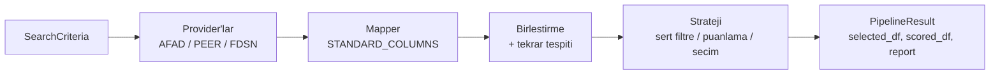

# SelectionEarthquake

[](https://pypi.org/project/earthquake-selection/)
[](https://pypi.org/project/earthquake-selection/)
[](https://github.com/muhammedsural/SelectionEarthquake/actions/workflows/tests.yml)
[](LICENSE)
[](https://muhammedsural.github.io/SELECTIONEARTHQUAKE)

Deprem kayitlarini AFAD, PEER NGA-West2 ve FDSN servislerinden cekip ortak
kolon semasina normalize eden; arama kriterlerine gore puanlayan ve
**TBDY 2018'e uygun, bolge ozelliklerine (buyukluk, uzaklik, mekanizma, zemin)
benzeyen deprem kayitlarini seçen** Python kutuphanesi.

> **Kapsam.** Bu kutuphane *aday kayit arama ve secimi* yapar. Ivme
> spektrumu hesabi, olceklendirme ve spektral eslestirme kapsam disindadir;
> secilen kayitlari bu isleri yapan bir arac (ornegin kendi sinyal isleme
> uygulamaniz) devralir.

## Icindekiler

- [Hizli baslangic](#hizli-baslangic)
- [Kurulum](#kurulum)
- [Veri saglayicilar](#veri-saglayicilar)
- [Nasil calisir?](#nasil-calisir)
- [Arama kriterleri](#arama-kriterleri)
- [Secim stratejileri ve scoring](#secim-stratejileri-ve-scoring)
- [TBDY 2018 uyumu](#tbdy-2018-uyumu)
- [Veri kalitesi: eksik veri ve tekrar tespiti](#veri-kalitesi-eksik-veri-ve-tekrar-tespiti)
- [Ciktilar ve rapor](#ciktilar-ve-rapor)
- [Waveform indirme ve FDSN](#waveform-indirme-ve-fdsn)
- [Komut satiri](#komut-satiri)
- [Python API ozeti](#python-api-ozeti)
- [Mimari](#mimari)
- [Gelistirme](#gelistirme)
- [1.x'ten 2.0'a gecis](#1xten-20a-gecis)
- [Dokumantasyon](#dokumantasyon)
- [Yol haritasi](#yol-haritasi)

## Hizli baslangic

Asagidaki ornek ag baglantisi gerektirmez (paketle gelen NGA-West2 verisini
kullanir). Marmara/Kuzey Anadolu benzeri bir senaryo icin 22 kayit (TBDY:
her yon 11 kayit) arar:

```python
from selection_service import EarthquakeAPI, DesignCode, ProviderName
from selection_service.processing.criteria import ScoringWeights, SearchCriteria, SelectionConfig
from selection_service.processing.strategies import TBDY2018ConstraintStrategy

strategy = TBDY2018ConstraintStrategy(
    SelectionConfig(
        design_code=DesignCode.TBDY_2018,
        num_records=22,       # 11 x 2 yon
        max_per_event=3,      # ayni depremden en fazla 3 kayit
        max_per_station=3,
        min_score=0,
    )
)

criteria = SearchCriteria(
    start_date="1990-01-01",
    end_date="2025-01-01",
    min_magnitude=6.5, max_magnitude=7.8,
    min_Rjb=0, max_Rjb=60,
    min_vs30=200, max_vs30=500,
    mechanisms=["StrikeSlip"],
    bbox=(34, 43, 25, 45),   # (min_lat, max_lat, min_lon, max_lon)
    weights=ScoringWeights.from_preset("tbdy_2018_record_selection"),
)

api = EarthquakeAPI(provider_names=[ProviderName.PEER], strategies=[strategy], use_cache=False)
result = api.run_sync(criteria=criteria, strategy_name=strategy.get_name())

if result.success:
    run = result.value
    print(run.selected_df[["PROVIDER", "RSN", "EVENT", "YEAR", "MAGNITUDE",
                           "RJB(km)", "VS30(m/s)", "SCORE"]].head())
    print(run.report["compliance"])      # 22 kayit / olay basina 3 kurali kontrolu
else:
    print(result.error)
```

Ornek cikti (paketle gelen PEER verisiyle gercek bir calistirma; secili kolonlar):

```text
  PROVIDER   RSN            EVENT  YEAR  MAGNITUDE  RJB(km)  VS30(m/s)      SCORE
     PEER  1162  Kocaeli, Turkey  1999       7.51    31.74     347.62  92.724459
     PEER  1615    Duzce, Turkey  1999       7.14     9.14     338.00  91.005081
     PEER  1620    Duzce, Turkey  1999       7.14    45.16     411.91  89.551056
     PEER  1602    Duzce, Turkey  1999       7.14    12.02     293.57  88.978679
     PEER  1177  Kocaeli, Turkey  1999       7.51    51.98     341.56  85.627623
```

Bu dar kriterlerle yalnizca 7 kayit bulunur; `compliance` bunu acikca soyler
(bkz. [TBDY 2018 uyumu](#tbdy-2018-uyumu)).

## Kurulum

```bash
pip install earthquake-selection
```

Paket adi `earthquake-selection`, import adi `selection_service`'dir.

| Ihtiyac | Komut |
| --- | --- |
| Temel kurulum (AFAD + PEER) | `pip install earthquake-selection` |
| FDSN provider'i (ObsPy tabanli) | `pip install "earthquake-selection[fdsn]"` |
| Gelistirme (test, lint) | `pip install -e ".[dev]"` |

Python 3.10 - 3.13 desteklenir. Yerel gelistirme:

```bash
git clone https://github.com/muhammedsural/SelectionEarthquake.git
cd SelectionEarthquake
pip install -e ".[dev]"
```

## Veri saglayicilar

| Provider | Kaynak | Ag | Waveform indirme | Notlar |
| --- | --- | --- | --- | --- |
| `ProviderName.PEER` | Paketle gelen NGA-West2 flatfile (~21.5 bin kayit) | Gerekmez | Yok | Tarih filtresi yil hassasiyetindedir; konum filtreleri hiposantre gore uygulanir |
| `ProviderName.AFAD` | AFAD TADAS API | Gerekir | Var (`mseed`, `asc2`, `asd`) | `HYPO_DEPTH(km)` yanittaki `relatedDepth` alanindan, yoksa `rhyp`/`repi`'den doldurulur |
| `ProviderName.FDSN` | ObsPy uyumlu FDSN servisleri (USGS, IRIS ...) | Gerekir | Waveform arama (`Stream`) | Istasyon ve waveform servisleri icin `[fdsn]` extra'si gerekir |

Birden fazla provider ayni anda kullanilabilir; sonuclar ortak kolon
semasinda birlesir. Yeni provider eklemek icin
[Provider Gelistirme](docs/provider-development.md) sayfasina bakin.

## Nasil calisir?



1. **Girdi:** `SearchCriteria` provider'a ozel parametrelere donusur
   (`to_afad_params()`, `to_peer_params()`, `to_fdsn_params()`).
2. **Cekme:** Provider'lar sync veya async calisir; basarisiz olan provider
   `failed_providers` listesine eklenir, digerleri devam eder. `use_cache=True`
   ile sonuclar `.cache/` altinda 24 saat onbelleklenir.
3. **Normalizasyon:** Mapper'lar ham kolonlari 33 kolonluk `STANDARD_COLUMNS`
   semasina cevirir.
4. **Birlestirme:** Provider'lar arasi ayni deprem/kayit tekrarlari tespit
   edilir (`EVENT_GROUP`).
5. **Secim:** Strateji kayitlari filtreler, puanlar ve kisitlara (kayit sayisi,
   olay/istasyon limiti) gore secer; her kayit icin `SELECTION_REASON` yazilir.
6. **Rapor:** `PipelineResult` secilen/tum kayitlari ve izlenebilir bir rapor icerir.

## Arama kriterleri

`SearchCriteria` tum provider'lar icin ortak modeldir (tum alanlar Pydantic ile dogrulanir).

| Grup | Alanlar |
| --- | --- |
| Tarih | `start_date`, `end_date` |
| Buyukluk / derinlik | `min_magnitude`, `max_magnitude`, `min_depth`, `max_depth` |
| Uzaklik | `min_Rjb` / `max_Rjb`, `min_Rrup` / `max_Rrup`, `min_Repi` / `max_Repi`, `min_Rhyp` / `max_Rhyp` |
| Zemin | `min_vs30`, `max_vs30` |
| Mekanizma | `mechanisms` (`StrikeSlip`, `Normal`, `Reverse`, ...), `fault_type` |
| Konum | `bbox=(min_lat, max_lat, min_lon, max_lon)`, ayri `min/max_latitude/longitude`, daire: `circleLatitude`, `circleLongitude`, `circleRadius` |
| Siddet olculeri | `min_pga` / `max_pga`, `min_pgv` / `max_pgv`, `min_pgd` / `max_pgd` |
| AFAD'a ozel | `station_code`, `network`, `country`, `province`, `district`, `neighborhood`, `event_name`, `region` |
| Hedefler | `target_magnitude`, `target_rjb`, `target_rrup`, `target_repi`, `target_vs30`, `target_pga`, `target_pgv`, `target_pgd`, `target_t90`, `target_arias`, `target_depth` |
| Agirliklar | `weights=ScoringWeights(...)` veya `ScoringWeights.from_preset(...)` |

Hedef verilmezse `(min + max) / 2` kullanilir; hicbiri yoksa kriter
puanlamaya katilmaz. Ayrintilar: [Arama Kriterleri](docs/search-criteria.md).

## Secim stratejileri ve scoring

| Strateji | `get_name()` | Yaklasim |
| --- | --- | --- |
| `TBDYSelectionStrategy` | `TBDY_2018_Gaussian` | Agirlikli Gaussian benzerlik skoru; esik (`min_score`) ustundekiler skora gore siralanir |
| `TBDY2018ConstraintStrategy` | `TBDY_2018_Constraint` | Once **sert filtre** (aralik disi / eksik veri / mekanizma uyumsuzlugu elenir), kalanlar normalize hata metrigine (`ERROR_TOTAL`) gore siralanir |
| `ConstraintSelectionStrategy` | `TBDY_2018_Constraint` | `TBDY2018ConstraintStrategy` icin geriye uyumlu takma ad |

Iki strateji de ayni depremden/istasyondan secilebilecek kayit sayisini
(`max_per_event`, `max_per_station`) uygular. Hangisini secmeli?

- Kriterleriniz **kesin sinirlar** ise (ornegin Vs30 200-500 m/s disina cikilamaz):
  `TBDY2018ConstraintStrategy`.
- Hedefe **yakinlik** onemliyse ve sinirlar esnekse: `TBDYSelectionStrategy`.

Hazir agirlik setleri `ScoringWeights.from_preset(...)` ile secilir:

| Preset | Vurgu |
| --- | --- |
| `balanced` | Varsayilan, dengeli agirliklar |
| `tbdy_2018_record_selection` | Buyukluk, mesafe, Vs30 ve mekanizma |
| `site_response` | Vs30, sure ve siddet olculeri |

```python
from selection_service.processing.criteria import ScoringWeights
print(ScoringWeights.preset_descriptions())
```

Mevcut sonuc uzerinde kriterleri degistirip yeniden secmek icin
`api.re_selection(df, strategy_name, new_criteria)` kullanilir (provider'lara
yeniden gitmez).

## TBDY 2018 uyumu

TBDY 2018 zaman tanim alaninda hesap icin deprem kaydi secimini sunlara
baglar; kutuphanedeki karsiliklari:

| Gereksinim | Kutuphanedeki karsiligi |
| --- | --- |
| Her yon icin 11 kayit (11 x 2 = **22**) | `SelectionConfig(num_records=22)` (varsayilan 22). Kayit takimi (H1 + H2) sayiyorsaniz `11` verin |
| Ayni depremden en fazla **3** kayit / kayit takimi | `SelectionConfig(max_per_event=3)`; sinir `EVENT_GROUP`'a gore uygulanir (ayni deprem iki provider'da farkli adla gelse de tek sayilir) |
| Tasarim depremi duzeyiyle uyumlu **buyukluk, fay uzakligi** | `min/max_magnitude`, `min/max_Rjb`, `min/max_Rrup` (+ `target_*`) |
| **Kaynak mekanizmasi** uyumu | `mechanisms=[...]` |
| **Yerel zemin kosullari** | `min_vs30`, `max_vs30`, `target_vs30` |

Secim sonunda rapor, sartlarin saglanip saglanmadigini bildirir:

```python
print(result.value.report["compliance"])
```

```json
{
  "selected_count": 7,
  "required_count": 22,
  "shortfall": 15,
  "max_per_event_limit": 3,
  "max_selected_per_event": 3,
  "max_per_event_ok": true,
  "compliant": false,
  "warnings": ["Yetersiz kayıt: 7/22 seçilebildi. Arama kriterlerini (büyüklük, uzaklık, Vs30, mekanizma) genişletin."]
}
```

Ayni uyarilar `result.value.logs` icinde `[WARN]` olarak da yer alir.
Yeterli kayit bulunamazsa kriterleri genisletin veya baska bir provider ekleyin.

> Ortalama spektrumun tasarim spektrumuna uygunlugu (olcekleme, periyot
> araligi) bu kutuphanenin degil, secilen kayitlari isleyen aracin
> sorumlulugundadir.

## Veri kalitesi: eksik veri ve tekrar tespiti

### Eksik veri

- **Ciktilar:** `selected_df`, `scored_df` ve `combined_df` icindeki sayisal
  bosluklar `0` ile doludur (asagi akis hesaplari NaN ile hata verdigi icin).
- **Secim sirasinda:** Algoritma bosluklari gorur. `VS30(m/s)` ve `MAGNITUDE`
  icin `0` "bilinmiyor" sayilir; Vs30 araligi verildiyse Vs30'u bilinmeyen kayit
  `missing:VS30(m/s)` nedeniyle elenir (bilinmeyen istasyon "Vs30 = 0 m/s"
  gibi puanlanmaz).

### Provider'lar arasi tekrar tespiti

Ayni deprem AFAD ve PEER'da farkli adlarla gelebilir. Birden fazla provider
kullaniliyorsa pipeline:

- **Olaylari eslestirir:** ayni yil, buyukluk farki `<= 0.5`, episantr mesafesi
  `<= 50 km` ve birbirinin en yakin adayi olan farkli-provider olaylari tek
  `EVENT_GROUP` olur (ayni provider'daki artci soklar birlestirilmez).
- **Tekrar kaydi eler:** ayni grupta, istasyon konumu `<= 1 km` olan ikinci
  kopya aday havuzundan cikarilir.

Davranis `SelectionConfig.dedup` ile ayarlanir:

```python
from selection_service import DesignCode, ProviderName
from selection_service.processing.criteria import DedupConfig, SelectionConfig

config = SelectionConfig(
    design_code=DesignCode.TBDY_2018,
    dedup=DedupConfig(
        prefer_provider=ProviderName.AFAD,  # tekrar kayitlarda AFAD korunur
        max_event_distance_km=50,
        max_mag_diff=0.5,
        max_station_distance_km=1.0,
        # enabled=False -> birlestirme ve eleme kapali
    ),
)
```

Sonuc `report["deduplication"]` icinde (`merged_event_groups`,
`duplicate_records_removed`) raporlanir. Eslestirme sezgiseldir; ortak bir
olay kimligi yoktur.

## Ciktilar ve rapor

`api.run_sync(...)` basariliysa `result.value` bir `PipelineResult`'tir:

| Alan | Aciklama |
| --- | --- |
| `selected_df` | Secilen kayitlar |
| `scored_df` | Degerlendirilen tum kayitlar (tekrar olarak elenenler haric) |
| `report` | Izlenebilir rapor sozlugu (asagida) |
| `failed_providers` | Veri donduremeyen provider'lar |
| `logs` | Pipeline olaylari ve uyarilar |
| `execution_time` | Saniye |

`report` anahtarlari: `selected_count`, `total_considered`, `strategy`,
`providers`, `records`, `statistics`, `selection_summary` (secilen/reddedilen
sayilari ve eleme gerekceleri), `score_breakdown`, `error_metrics`,
`compliance`, `deduplication`.

`scored_df` izlenebilirlik kolonlari: `SCORE`, `SCORE_BREAKDOWN`,
`SELECTION_STATUS` (`selected` / `rejected`), `SELECTION_REASON`
(`selected`, `score_below_min_score:55.0`, `max_per_event:3`,
`max_per_station:3`, `num_records_limit:22`, `vs30_below_min:200.0` ...),
`EVENT_GROUP`; constraint stratejisinde ayrica `HARD_FILTERS`,
`ERROR_METRICS`, `ERROR_TOTAL`.

Disa aktarma:

```python
run.selected_df.to_csv("selected_records.csv", index=False)

import json
with open("selection_report.json", "w", encoding="utf-8") as f:
    json.dump(run.report, f, indent=2, ensure_ascii=False, default=str)
```

## Waveform indirme ve FDSN

**AFAD** (secilen kayitlari indirme): download desteklemeyen provider'lar
(PEER gibi) atlanir.

```python
download = api.download_waveforms(
    run.selected_df,
    export_type="mseed",   # "mseed" | "asc2" | "asd"
    batch_size=10,
)
if not download.success:
    print(download.error)
```

Tek dosyalik ve sorunlu kayit iceren partiler dogru islenir (tek sorunlu kayit
tum partiyi dusurmez). Ayrintilar: [Waveform Indirme](docs/waveform-download.md).

**FDSN** istasyon ve waveform servisleri (`[fdsn]` extra'si gerekir):

```python
api = EarthquakeAPI(provider_names=[ProviderName.FDSN], strategies=[strategy])

stations = api.search_fdsn_stations(
    network="TU", station="*", channel="HN?",
    starttime="2023-02-06", endtime="2023-02-07",
)
stream = api.search_fdsn_waveforms(
    network="TU", station="ANK", location="*", channel="HN?",
    starttime="2023-02-06T01:16:00Z", endtime="2023-02-06T01:17:00Z",
)
```

Istasyon sonucu kanal basina bir DataFrame satiri, waveform sonucu ObsPy
`Stream`'dir. Metotlarin `_async` surumleri de vardir.

## Komut satiri

Kurulumdan sonra `quake-sel` komutu uctan uca arama, secim ve rapor uretir:

```bash
quake-sel --providers peer --num-records 22 \
          --report-path selection_report.json --selected-csv selected_records.csv

# AFAD: arama + secilen kayitlarin waveform'larini indirme (ag gerekir)
quake-sel --providers afad --download-waveforms --export-type mseed
```

| Secenek | Varsayilan | Aciklama |
| --- | --- | --- |
| `--providers` | `peer` | `peer`, `afad`, `fdsn` (birden fazla verilebilir) |
| `--start-date`, `--end-date` | `2000-01-01`, `2025-09-05` | Tarih araligi |
| `--min-magnitude`, `--max-magnitude` | `7.0`, `8.0` | Buyukluk araligi |
| `--min-vs30`, `--max-vs30` | `300`, `400` | Vs30 araligi (m/s) |
| `--mechanism` | `StrikeSlip` | Tekrarlanabilir |
| `--num-records` | `11` | Secilecek kayit sayisi |
| `--min-score` | `55` | Minimum skor |
| `--strategy` | `gaussian` | `gaussian` veya `constraint` |
| `--scoring-preset` | `tbdy_2018_record_selection` | `balanced`, `tbdy_2018_record_selection`, `site_response` |
| `--report-path` | `selection_report.json` | JSON rapor |
| `--selected-csv` | `selected_records.csv` | Secilen kayitlar |
| `--download-waveforms` | kapali | Secilenleri indir (AFAD) |
| `--export-type` | `mseed` | `mseed`, `asc2`, `asd` |

Ayrintilar: [CLI](docs/cli.md).

## Python API ozeti

| Sinif / fonksiyon | Rol |
| --- | --- |
| `EarthquakeAPI` | Ana giris noktasi (facade): `run_sync`, `run_async`, `re_selection`, `download_waveforms`, `download_single_waveform`, `search_fdsn_stations`, `search_fdsn_waveforms` |
| `SearchCriteria`, `ScoringWeights` | Arama kriterleri ve agirliklar |
| `SelectionConfig`, `DedupConfig` | Secim limitleri ve tekrar tespiti ayarlari |
| `TBDYSelectionStrategy`, `TBDY2018ConstraintStrategy` | Secim stratejileri |
| `EarthquakePipeline` | Dusuk seviyeli pipeline (ozel akislar icin) |
| `ProviderFactory`, `ColumnMapperFactory` | Provider ve mapper uretimi |
| `IDataFetcher`, `IWaveformDownloader` | Yeni provider yazmak icin sozlesmeler |
| `setup_logging` | Log yapilandirmasi |

Sonuclar `Result` tipiyle doner (`result.success`, `result.value`,
`result.error`); hatalar istisna firlatmak yerine tasinir.

## Mimari

```text
selection_service/
  core/         EarthquakeAPI (facade), pipeline, config, hata tipleri, logging
  services/     Sorgu servisi, provider kayit defteri, waveform indirme servisi
  providers/    AFAD, PEER, FDSN, cache, provider sozlesmeleri (interfaces.py)
  processing/   criteria (SearchCriteria, SelectionConfig, DedupConfig),
                strategies/ (base, tbdy, eurocode), mappers, dedup, Result
  enums/        ProviderName, DesignCode
  utility/      Veri dosyasi yukleme yardimcilari
  data/         Paketle gelen NGA-West2 flatfile ve istasyon verisi
tests/          pytest paketi
examples/       Kullanim ornekleri ve notebook'lar
docs/           MkDocs dokumantasyonu
```

## Gelistirme

```bash
pip install -e ".[dev]"

python -m pytest                                              # testler
python -m pytest --cov=src/selection_service --cov-fail-under=80   # coverage (CI esigi)
flake8 src --select=E9,F63,F7,F82                             # CI lint
pip install -r requirements-docs.txt && mkdocs build --strict # dokumantasyon
```

CI (GitHub Actions) Python 3.10 - 3.13 uzerinde testleri, lint'i ve coverage
esigini calistirir. Katki icin: branch acin, davranis degisikligine test
ekleyin, dokuman orneklerinin gercek API ile calistigini dogrulayin
([Test ve Kalite](docs/testing.md)).

## 1.x'ten 2.0'a gecis

2.0.0 kirici degisiklikler icerir. `from selection_service import ...` ile
yapilan ust duzey import'lar degismedi; modul yollari degisti:

| Eski | Yeni |
| --- | --- |
| `selection_service.core.EarthquakeApi` | `selection_service.core.earthquake_api` |
| `selection_service.processing.Selection` | `selection_service.processing.criteria` (kriterler) ve `...processing.strategies` (stratejiler) |
| `IDataProvider` | `IDataFetcher` / `IWaveformDownloader` |
| `SpectrumMatchStrategy`, `ParetoSelectionStrategy`, `--strategy spectrum/pareto` | Kaldirildi |
| `obspy` zorunlu bagimlilik | Opsiyonel: `pip install "earthquake-selection[fdsn]"` |

Tum modul adlari `snake_case` oldu. Tam liste ve davranis duzeltmeleri:
[2.0 Gecis Rehberi](docs/migration-v2.md).

## Dokumantasyon

Tum dokumantasyon: <https://muhammedsural.github.io/SELECTIONEARTHQUAKE>

| Konu | Sayfa |
| --- | --- |
| Hizli baslangic | [docs/quickstart.md](docs/quickstart.md) |
| Temel kavramlar | [docs/concepts.md](docs/concepts.md) |
| Arama kriterleri | [docs/search-criteria.md](docs/search-criteria.md) |
| Scoring ve presetler | [docs/scoring.md](docs/scoring.md) |
| Raporlama | [docs/reporting.md](docs/reporting.md) |
| Waveform indirme | [docs/waveform-download.md](docs/waveform-download.md) |
| Provider gelistirme | [docs/provider-development.md](docs/provider-development.md) |
| Sorun giderme | [docs/troubleshooting.md](docs/troubleshooting.md) |
| Orneklerle tam akis | [examples/full_feature_walkthrough.ipynb](examples/full_feature_walkthrough.ipynb) |

## Yol haritasi

- FDSN waveform sonuclarini dosyaya aktarma ve secim akisiyla iliskilendirme.
- Eurocode 8 stratejisini gercek kurallarla doldurma (`EurocodeSelectionStrategy`
  su an yer tutucudur; `DesignCode` yalnizca `TBDY_2018` icerir).
- Rapor ciktilarini HTML/PDF formatina genisletme.
- Dedup eslestirmesini tam olay tarihini kullanacak sekilde iyilestirme.

## Lisans

MIT License
